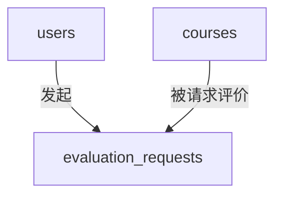
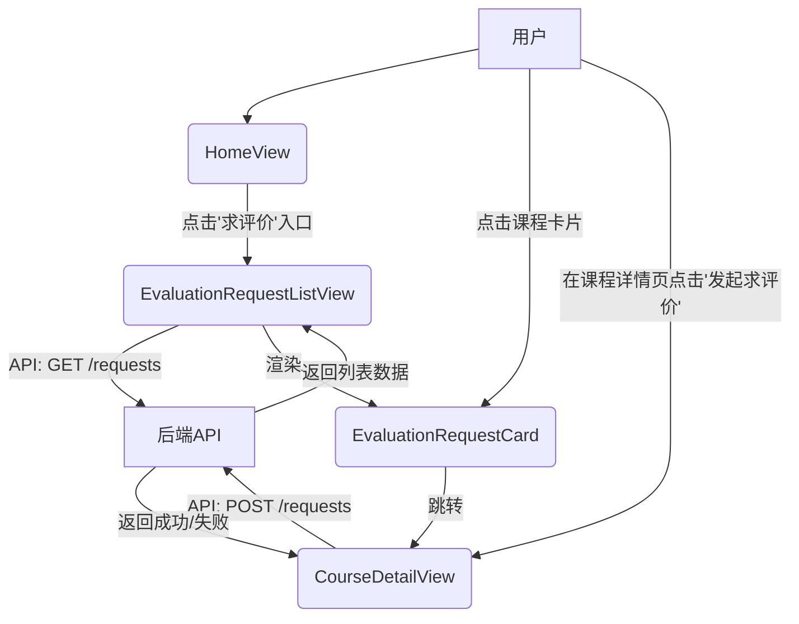

# “求评价”功能设计文档

本文档详细规划了“选课通”项目的新功能——“求评价”的架构设计，涵盖数据库、后端API和前端组件。

## 1. 数据库设计

为了存储“求评价”请求，我们决定新增一个专用的数据表 `evaluation_requests`。

### 1.1. 表结构设计 (`evaluation_requests`)

| 字段名      | 类型         | 约束/索引              | 描述                                     |
|-------------|--------------|------------------------|------------------------------------------|
| `id`        | `INT`        | `PRIMARY KEY`, `AUTO_INCREMENT` | 请求的唯一标识符                         |
| `user_id`   | `INT`        | `FOREIGN KEY (users.id)` | 发起请求的用户的ID                       |
| `course_id` | `INT`        | `FOREIGN KEY (courses.id)` | 被请求评价的课程的ID                     |
| `status`    | `VARCHAR(20)`| `DEFAULT 'pending'`      | 请求的状态 (例如: 'pending', 'closed') |
| `created_at`| `DATETIME`   |                        | 请求创建时间                             |
| `updated_at`| `DATETIME`   |                        | 请求最后更新时间                         |

### 1.2. Go 模型定义 (`evaluation_request.go`)

虽然我们不直接创建文件，但对应的Go模型结构如下所示，以供后端开发参考：

```go
package models

import "time"

// EvaluationRequest represents a user's request for course evaluation.
type EvaluationRequest struct {
	ID        uint      `gorm:"primaryKey" json:"id"`
	UserID    uint      `gorm:"not null" json:"userId"`
	User      User      `gorm:"foreignKey:UserID" json:"user"`
	CourseID  uint      `gorm:"not null" json:"courseId"`
	Course    Course    `gorm:"foreignKey:CourseID" json:"course"`
	Status    string    `gorm:"type:varchar(20);default:'pending'" json:"status"` // e.g., 'pending', 'closed'
	CreatedAt time.Time `json:"createdAt"`
	UpdatedAt time.Time `json:"updatedAt"`
}

func (EvaluationRequest) TableName() string {
	return "evaluation_requests"
}
```

### 1.3. 关系图



---
## 2. 后端API设计

所有API都应以 `/api` 为前缀，并需要进行用户身份认证。

### 2.1. 发起求评价请求

-   **Endpoint**: `POST /api/evaluation-requests`
-   **Description**: 用户为某一课程发起“求评价”请求。
-   **Authentication**: Required (Standard user role)
-   **Request Body**:
    ```json
    {
      "courseId": 123
    }
    ```
-   **Success Response (201 Created)**:
    ```json
    {
      "id": 1,
      "userId": 45,
      "courseId": 123,
      "status": "pending",
      "createdAt": "2023-10-27T10:00:00Z",
      "user": {
        "id": 45,
        "nickname": "张三"
      },
      "course": {
        "id": 123,
        "name": "计算机网络"
      }
    }
    ```
-   **Error Responses**:
    -   `400 Bad Request`: 如果 `courseId` 无效或缺失。
    -   `401 Unauthorized`: 用户未登录。
    -   `409 Conflict`: 该课程已经存在一个活跃的“求评价”请求。

### 2.2. 获取求评价列表

-   **Endpoint**: `GET /api/evaluation-requests`
-   **Description**: 获取所有正在“求评价”的课程列表，支持分页。
-   **Authentication**: Not required (Publicly accessible)
-   **Query Parameters**:
    -   `page` (optional, int, default: 1): 页码。
    -   `pageSize` (optional, int, default: 10): 每页数量。
-   **Success Response (200 OK)**:
    ```json
    {
      "total": 1,
      "page": 1,
      "pageSize": 10,
      "items": [
        {
          "id": 1,
          "userId": 45,
          "courseId": 123,
          "status": "pending",
          "createdAt": "2023-10-27T10:00:00Z",
          "user": {
            "id": 45,
            "nickname": "张三"
          },
          "course": {
            "id": 123,
            "name": "计算机网络",
            "teacher": "王老师",
            "imageURL": "/images/course.png"
          }
        }
      ]
    }
    ```

---
## 3. 前端组件和路由设计

### 3.1. 新增路由

在 `src/router/index.ts` 中新增以下路由：

```javascript
{
  path: '/evaluation-requests',
  name: 'EvaluationRequestList',
  component: () => import('../views/EvaluationRequestListView.vue'),
  meta: { title: '求评价列表' }
}
```

### 3.2. 新增页面 (View)

#### `EvaluationRequestListView.vue`

-   **路径**: `src/views/EvaluationRequestListView.vue`
-   **功能**:
    1.  调用 `GET /api/evaluation-requests` API 获取求评价列表。
    2.  展示一个课程卡片列表，每个卡片包含课程名称、教师、发起人昵称和发起时间。
    3.  实现分页功能。
    4.  点击卡片后，通过 `router.push` 跳转到该课程的详情页（例如 `/courses/:id`）。
-   **依赖组件**: `EvaluationRequestCard.vue`, `Pagination.vue` (如果已有)。

### 3.3. 新增组件 (Component)

#### `EvaluationRequestCard.vue`

-   **路径**: `src/components/EvaluationRequestCard.vue`
-   **功能**:
    -   以卡片形式展示单个“求评价”课程的信息。
    -   接收一个 `request` 对象作为 prop。
    -   显示课程图片、名称、教师、发起人等。
    -   包含一个“去评价”按钮或整个卡片可点击，触发跳转事件。

### 3.4. 修改现有组件

#### `HomeView.vue` (或主页相关组件)

-   **路径**: `src/views/HomeView.vue`
-   **修改点**:
    -   在页面的显眼位置（例如导航栏下方或一个专门的板块）增加一个入口。
    -   这个入口可以是一个Banner、一个卡片或一个按钮，文本为“查看求评价课程”。
    -   使用 `<router-link to="/evaluation-requests">` 包裹该入口，使其可以跳转到列表页。

#### `CourseDetailView.vue` (或课程详情页)

-   **路径**: `src/views/CourseDetailView.vue`
-   **修改点**:
    -   在课程详情页的某个位置（例如课程信息旁边或评价区顶部）增加一个“发起求评价”的按钮。
    -   该按钮仅在用户登录后显示。
    -   点击按钮后，调用 `POST /api/evaluation-requests` API。
    -   需要处理重复点击和请求成功/失败的UI反馈（例如，禁用按钮、显示提示信息）。

### 3.5. 组件交互流程图



---