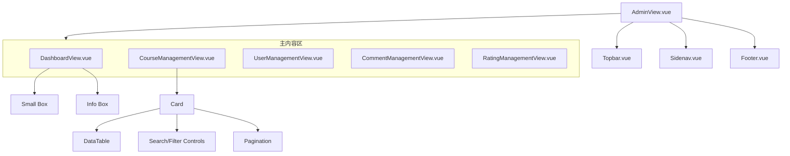

# 选课通后台管理UI设计规范

## 1. 引言

本文档旨在为“选课通”项目的后台管理界面提供详细的UI设计规划。设计方案基于 AdminLTE 4 框架，并遵循 Vue 组件化的开发思想。本文档将作为前端开发的蓝图，确保开发工作高效、统一。

## 2. 选定的AdminLTE组件

为了构建一个功能完善且风格统一的后台管理系统，我们选用以下 AdminLTE (Bootstrap-based) 核心组件：

| 组件名称 | 选用理由 | 参考示例 |
| :--- | :--- | :--- |
| **Card (`.card`)** | 作为页面内容的基本容器，提供清晰的区块划分，并自带头部、主体、底部结构，便于组织表格、表单等元素。 | `AdminLTE/src/html/pages/widgets/cards.astro` |
| **Data Table (`.table`)** | 用于以结构化方式展示列表数据，如课程、用户、评论等。支持边框、条纹等多种样式，并可与分页控件结合使用。 | `AdminLTE/src/html/pages/tables/simple.astro` |
| **Small Box (`.small-box`)** | 适用于在仪表盘（Dashboard）上展示关键统计数据，设计紧凑、醒目，并可内嵌链接指向详情页面。 | `AdminLTE/src/html/pages/widgets/small-box.astro` |
| **Info Box (`.info-box`)** | 同样用于展示统计数据，但提供更大的空间展示图标和附加信息（如进度条），适合需要更多上下文的指标。 | `AdminLTE/src/html/pages/widgets/info-box.astro` |
| **Form Elements** | 包含输入框、下拉选择、按钮等标准表单控件，用于构建数据添加和编辑功能。 | `AdminLTE/src/html/pages/forms/general.astro` |
| **Modal** | 用于处理需要用户确认的操作（如删除）或展示额外信息，可以提升用户体验，避免页面跳转。 | Bootstrap 5 Modal 文档 |

## 3. 整体页面布局

后台管理界面将采用经典的侧边栏导航布局，其根组件为 `AdminView.vue`。

- **`AdminView.vue` 结构:**
  - **顶部导航栏 (`Topbar.vue`):** 固定在页面顶部，用于显示用户信息和登出等操作。
  - **侧边导航栏 (`Sidenav.vue`):** 固定在页面左侧，是后台功能的主要入口。
  - **主内容区 (`<router-view>`):** 动态渲染各个子视图（如仪表盘、课程管理等）。
  - **页脚 (`Footer.vue`):** 固定在页面底部，显示版权信息。

- **侧边栏导航 (`Sidenav.vue`) 菜单项:**
  - 仪表盘 (Dashboard)
  - 课程管理 (Course Management)
  - 用户管理 (User Management)
  - 评论管理 (Comment Management)
  - 评分管理 (Rating Management)

## 4. 组件层级关系



## 5. 仪表盘 (Dashboard) 设计

本章节详细定义仪表盘的UI布局、数据指标、组件选择和后端API接口。

### 5.1. 核心数据指标

仪表盘将展示以下核心数据指标，以便管理员快速了解平台状态：

- **总用户数 (Total Users):** 平台注册用户总数。
- **总课程数 (Total Courses):** 平台已发布的课程总数。
- **总评论数 (Total Comments):** 用户发表的评论总数。
- **全站课程平均评分 (Average Rating):** 所有课程的平均分。
- **本周新增用户数 (New Users This Week):** 最近7天内新增的注册用户数。
- **待审核评论数 (Pending Comments):** 等待管理员审核的评论数量。

### 5.2. 组件选择与布局

- **布局描述:**
  - 页面顶部将由一行 `small-box` 和一行 `info-box` 组成，用于展示上述核心指标。
  - 每个组件都包含标题、数值和相关的图标。

- **组件分配:**
  - **`small-box` 组件 (用于核心摘要数据):**
    - **总课程数:** 蓝色背景 (`text-bg-primary`)，课程图标。
    - **总用户数:** 黄色背景 (`text-bg-warning`)，用户图标。
    - **总评论数:** 红色背景 (`text-bg-danger`)，评论图标。
    - **平均评分:** 绿色背景 (`text-bg-success`)，评分/星级图标。
  - **`info-box` 组件 (用于需要关注的动态数据):**
    - **本周新增用户数:** 标准背景色，`bi-people-fill` 图标。
    - **待审核评论数:** 红色背景 (`text-bg-danger`)，`bi-chat-text-fill` 图标，以示紧急。

### 5.3. 后端API接口设计

为了给仪表盘提供数据，需要设计一个统一的后端API端点。

- **端点 (Endpoint):** `GET /api/v1/admin/stats`
- **描述:** 获取后台管理仪表盘所需的所有统计数据。
- **请求方法:** `GET`
- **认证:** 需要管理员权限。
- **返回数据结构 (JSON):**
  ```json
  {
    "total_users": 150,
    "total_courses": 75,
    "total_comments": 320,
    "average_rating": 4.5,
    "new_users_this_week": 12,
    "pending_comments": 5
  }
  ```

## 6. 子视图设计详述

### 6.1. 课程管理 (CourseManagementView.vue)

- **布局描述:**
  - 整个页面由一个 `Card` 组件构成。
  - `Card Header` 包含页面标题、一个“添加课程”按钮和一组用于数据筛选的表单控件。
  - `Card Body` 包含一个 `Data Table`，用于展示课程列表。
  - `Card Footer` 包含分页控件。
- **线框图 (文字描述):**
  ```
  +----------------------------------------------------------------------+
  | Card Header: 课程列表                                [添加课程] 按钮 |
  | [按年级筛选] [按学期筛选] [按科目搜索] [搜索]                          |
  +----------------------------------------------------------------------+
  | Card Body:                                                           |
  | +------------------------------------------------------------------+ |
  | | ID | 课程名称 | 教师 | 年级 | 学期 | 科目 | 操作                  | |
  | +----+----------+------+------+------+------+-----------------------+ |
  | | 1  | ...      | ...  | ...  | ...  | ...  | [编辑] [删除]         | |
  | | 2  | ...      | ...  | ...  | ...  | ...  | [编辑] [删除]         | |
  | +------------------------------------------------------------------+ |
  +----------------------------------------------------------------------+
  | Card Footer: [<<] [1] [2] [3] [>>] (分页控件)                         |
  +----------------------------------------------------------------------+
  ```
- **操作流程:**
  - 点击“删除”按钮时，弹出一个 **Modal** 确认框。

### 6.2. 用户管理 (UserManagementView.vue)

- **布局描述:**
  - 与课程管理页面布局类似，使用 `Card` 和 `Data Table`。
- **数据表格列:**
  - `ID`, `用户名`, `邮箱`, `角色`, `注册时间`, `操作` (查看详情/禁用)。

### 6.3. 评论管理 (CommentManagementView.vue)

- **布局描述:**
  - 与课程管理页面布局类似。
- **数据表格列:**
  - `ID`, `评论内容`, `评论用户`, `所属课程`, `发布时间`, `操作` (删除)。

### 6.4. 评分管理 (RatingManagementView.vue)

- **布局描述:**
  - 与课程管理页面布局类似。
- **数据表格列:**
  - `ID`, `评分值`, `评分用户`, `所属课程`, `发布时间`, `操作` (删除)。

### 6.5. 添加/编辑课程 (CourseCreateView.vue / CourseEditView.vue)

- **布局描述:**
  - 一个独立的页面或通过 **Modal** 弹出。
  - 页面由一个 `Card` 构成，`Card Body` 内是一个表单。
- **表单字段:**
  - 课程名称 (Input)
  - 课程描述 (Textarea)
  - 教师 (Input)
  - 年级 (Select)
  - 学期 (Select)
  - 科目 (Input)
- **操作:**
  - `Card Footer` 包含“保存”和“取消”按钮。